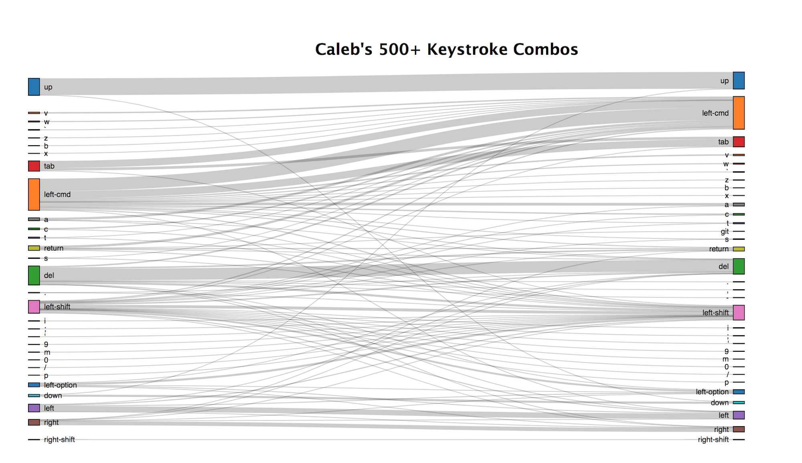

# Keylogger Parsing

**This is a repository for a tool to export and visualize the keystroke data generated by [GiacomoLaw's Keylogger Tool](https://github.com/GiacomoLaw/Keylogger) tool.**



This tool ingests the `keystroke.log` file of the Keylogger tool and makes two things:

#### 1. Five JSON files:
1. Frequency of single **commands** typed (e.g. `[return]`,`[left-cmd]`, `[del]`).

2. Frequency of single **non-commands** (keystrokes & words) typed (e.g. `t`,`13`, `not`).

3. Frequency of **bi-grams** (2 keystroke combinations - e.g. `h`+`i`, `[left-cmd]`+`[tab]`, `ma`+`[return]`).

4. Frequency of **tri-grams** (3 keystroke combinations - e.g. `s`+`u`+`p`,`[left-cmd][left-shift]`+`v`, `[left-cmd]`+`[tab]`+`[tab]`).

*^these 4 JSON files can be used for data analysis.*

5. Frequency of **bigrams** (like #3, but) in the "graph" data format used by the D3 Sankey.

*^this JSON is used to create the visualization depicted above.*

#### B. A Sankey Diagram of Bi-grams:

An interactive visualization of bi-grams made with [Evan Galloway's D3 Sankey Diagram](https://bl.ocks.org/gallowayevan/88d7c27ac2d1cfb78541d96b7477b43c).

## **Using This Tool - Quick & Dirty**

**If you have data from [GiacomoLaw's Keylogger Tool](https://github.com/GiacomoLaw/Keylogger) in a `keystroke.log` file, you can use this tool by following these steps:**

1. Clone or download this repository: `git clone https://github.com/calebfergie/keylogger-parsing.git`

2. Install node dependencies: `cd keylogger-parsing && npm install`

3. Add/copy your `keystroke.log` file into the data folder - [public/data](public/data/)

4. Start the node server: `node bin/www`

The [data folder](public/data) should now have files (`commands.json`,`words.json`,`bigrams.json`,`trigrams.json`) updated with your data.

If you navigate to `localhost:5000` in your browser, the sankey digram should appear. It is slightly interactive, try dragging the nodes up & down.

## **Using This Tool - Details**

#### JSON File Details

The JSON files mentioned above are formatted as in the examples below:

1. Frequency of single **commands** typed (e.g. `[return]`,`[left-cmd]`, `[del]`):
```
[{"value":"left-cmd","type":"command","frequency":62706},
{"value":"del","type":"command","frequency":33336},
{"value":"left-shift","type":"command","frequency":27040}]
```
2. Frequency of single **non-commands** (keystrokes & words) typed (e.g. `t`,`13`, `not`):
```
[{"value":"if","type":"character","frequency":97}},
{"value":"can","type":"character","frequency":96},
{"value":"do","type":"character","frequency":95}]
```
3. Frequency of **bi-grams** (2 keystroke combinations - e.g. `h`+`i`, `[left-cmd]`+`[tab]`, `ma`+`[return]`):
```
[{"value":["left-cmd","v"],"frequency":2496},
{"value":["left-cmd","c"],"frequency":2388},
{"value":["left-option","left-shift"],"frequency":2206}]
```
4. Frequency of **tri-grams** (3 keystroke combinations - e.g. `s`+`u`+`p`,`[left-cmd][left-shift]`+`v`, `[left-cmd]`+`[tab]`+`[tab]`):
```
[{"value":["return","return","return"],"frequency":718},
{"value":["left","left-option","left-shift"],"frequency":713},
{"value":["s","left-cmd","left-cmd"],"frequency":712}]
```

5. Frequency of **bigrams** in the "graph" data format used by the D3 Sankey:
```
  {
    "nodes":[
            {"name":"left-cmd","type":"source"},
            {"name":"down","type":"target"}
            ...],
    "links":[
            {"source":14,"target":3,"value":527},
            {"source":14,"target":41,"value":526}
            ...]
  ```

#### Parsing the .log file:

 This tool is written with node.js with the code to process `keystroke.log` is stored in the [log-parser.js](public/data/log-parser.js) in the repository.

 The [bigrams.json](public/data/bigrams.json) and bigrams.json](public/data/bigrams.json) files don't include all bi-grams and tri-grams. They are limited to results that appear with a certain frequency (or more). You can change this frequency by changing the value of `freqFilter` in the file [log-parser.js](public/data/log-parser.js) file, set to 250 in the example below:

 `var freqFilter = 250; //minimum number of occurrences to be included in the output`

 The `app.js` file runs the `log-parser.js` file and then serves the D3 visualization through an express server.

 The code for the D3 tool is adapted from [Evan Galloway's D3 Sankey Diagram](https://bl.ocks.org/gallowayevan/88d7c27ac2d1cfb78541d96b7477b43c), stored in the file [galloway-sankey.json](public/databigrams.json)

## **Context**

This tool was made in order to perform analysis on my own keystroke data. Use at your own risk!

It was done in an effort to understand my conscious and subconscious decisions - as part of [NYU ITPs Rest of You](https://itp.nyu.edu/classes/roy19/) class.

- **Feb. 4**: Installed [this keylogger](https://github.com/GiacomoLaw/Keylogger) on my mac.
- **Feb. 4 - 23**: Engaged in normal computer use
- **Feb. 23**: Created first [log-parser.js](public/data/log-parser.js) file.
- **March 23**: Added sankey data visualization & cleaned up tool

## Data Analysis

I was mostly interested in what keystrokes I typed *in combination* - keyboard shortcuts (e.g. `ctrl+c`, `ctrl+v`, `ctrl+tab`) and repeated key presses (e.g. `tab+tab+tab`, `delete+delete+delete`).

More analysis to come.
